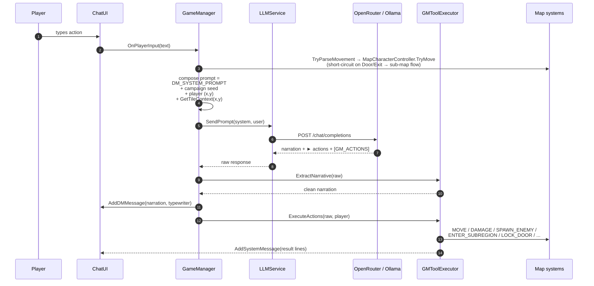
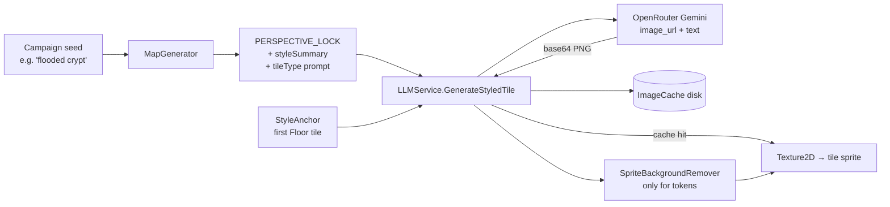

# LLM Integration Guide

How the LLM layer is wired, how to swap or configure providers, and the exact contract the DM prompt uses to mutate game state.

---

## 1. Two LLM paths, not one

The codebase has two abstractions that both say "LLM". Treat them as separate concerns:

| Path | Used by | What it does |
|------|---------|--------------|
| **`LLMService`** (`Assets/Scripts/Services/LLMService.cs`, MonoBehaviour singleton) | `GameManager` (DM narration), `MapGenerator` (tile descriptions), `MapGenerator` + `GameManager` (tile/token image generation) | Real HTTP client. Talks to OpenRouter (chat + image) or Ollama (chat). On-disk image caching. |
| **`ILLMProvider`** (`Assets/Scripts/AI/ILLMProvider.cs`) | `DungeonMaster.GenerateCampaignAsync` / `GenerateCreatureAsync`, `CommandParser.ParseCommandAsync` | Text-only interface. The only implementation today is `MockLLMProvider`. Exists so campaign generation can be swapped to a different backend without touching `LLMService`. |
| **`TTSService`** (`Assets/Scripts/Services/TTSService.cs`, MonoBehaviour singleton) | `ChatUI` (play buttons on DM bubbles) | Streams DM narration audio from OpenRouter `openai/gpt-audio`. SSE + base64 WAV chunks. On-disk audio caching. |

All player-facing DM narration goes through `LLMService`. `ILLMProvider` handles campaign-timeline generation and natural-language command parsing, and currently always uses the mock.

Configure providers from the `LLMService` component inspector — see [`SETUP_GUIDE.md`](SETUP_GUIDE.md#3-configure-the-llm-backend) for the full field list.

---

## 2. Supported backends

### OpenRouter (default)

- Endpoint: `https://openrouter.ai/api/v1/chat/completions` and `/images/generations`.
- Auth: bearer `Api Key`.
- Chat model: any OpenRouter-hosted model slug. Default `openai/gpt-4o-mini` for cost; `anthropic/claude-sonnet-4-6` or `openai/gpt-4o` for higher quality DM narration.
- Image model: must be a multimodal Gemini model (e.g. `google/gemini-2.5-flash-image-preview`) if you want **style-anchored tile generation** — see §4. DALL-E-style endpoints work for single-shot images but cannot consume a reference image, so map tiles drift in style.

### Ollama (local, text only)

- Endpoint: `{Ollama Base Url}/v1/chat/completions` (OpenAI-compatible surface).
- No auth header.
- Set any pulled model tag, e.g. `llama3.2`, `mistral`, `qwen2.5`.
- Images still go to OpenRouter. If `Api Key` is empty while `Provider = Ollama`, image calls will fail — which is fine for text-only playtesting but you will not see map tile art.

### Mock

- Toggle `Use Mock` on `LLMService` to return stub strings and random-colour textures. Good for UI work and regression tests without burning credits.

---

## 3. DM prompt contract

All exploration narration uses a single large system prompt defined in `GameManager.cs` as `DM_SYSTEM_PROMPT`. The important invariants:

1. **2–4 sentence narration** in present tense.
2. Exactly **3 suggested actions**, each on its own line, prefixed with `► `.
3. An optional **`[GM_ACTIONS]` … `[/GM_ACTIONS]`** block containing zero or more tool calls, one per line, to mutate state.

Example tail of a response the code parses successfully:

```
► Search the body
► Retreat north
► Call for help
[GM_ACTIONS]
DAMAGE player 4
AWARD_XP 25
[/GM_ACTIONS]
```

`GMToolExecutor.ExtractNarrative` strips the `[GM_ACTIONS]` block before it reaches `ChatUI`. `GMToolExecutor.ExecuteActions` executes each line and returns human-readable result strings posted as system messages.

### Supported tool commands

| Command | Effect |
|---------|--------|
| `MOVE player <north\|south\|east\|west>` | Moves the player token if the target tile is walkable |
| `DAMAGE player <amount>` | `CharacterStats.TakeDamage` |
| `HEAL player <amount>` | `CharacterStats.Heal` |
| `ADD_CONDITION player <poisoned\|blinded\|stunned\|frightened>` | Applies a D&D 5e condition with 3-round duration |
| `REMOVE_CONDITION player <condition>` | Clears the condition |
| `SPAWN_ENEMY <name> <hp> <ac>` | Creates a `CharacterStats` enemy and immediately starts combat |
| `AWARD_XP <amount>` | Adds to `player.currentXP` |
| `KILL_ENTITY <name>` | Removes the matching `MapEntityController` from the map |
| `LOCK_DOOR <x> <y>` / `UNLOCK_DOOR <x> <y>` | Flips `walkable` on the tile |
| `ENTER_SUBREGION <description>` | Pushes the current map onto `MapGraph` and generates a new interior themed by `<description>` |

If the LLM invents a command not in this list, the line is ignored with a warning. Keep the system prompt authoritative about the command list.

---

## 4. LLM pipeline — exploration flow

This is what happens when the player types free-form input during `GameState.Exploration`.



**Why the DM system prompt is defined in `GameManager`, not `DungeonMaster`.** `DungeonMaster` is used only for campaign-timeline generation and creature stats. The per-turn narration path is kept in `GameManager` because it needs live `MapGenerator.GetTileContext`, `MapCharacterController` position, and has to dispatch `GMToolExecutor` afterwards. `DungeonMaster` has its own, simpler system prompt for timeline generation.

---

## 5. Tile art pipeline

Every map tile is generated individually. The first Floor tile acts as a **style anchor** — it is re-sent as an input image on every subsequent tile call, so Gemini keeps the palette, brushwork, and perspective consistent.



Key points from `LLMService.GenerateStyledTile`:

- The request JSON is hand-built (not via `JsonUtility`) because Unity's serializer cannot emit the `content: [ {type:image_url, …}, {type:text, …} ]` array shape Gemini expects.
- If `Image Model` does **not** start with `google/`, the call falls back to plain `GenerateImage` — the anchor is ignored. Expect visual drift.
- Tokens (player / NPCs / enemies) also use `GenerateStyledTile` with a "transparent background" prompt, then pass through `SpriteBackgroundRemover` which alpha-keys the remaining background against tile colours.
- Cache hits bypass the network entirely. Delete `Application.persistentDataPath/ImageCache/` to force regeneration.

---

## 6. Adding a new backend

Two insertion points depending on what you want to cover:

### A. Swap the live chat+image backend

Edit `LLMService.SendPrompt` / `GenerateImage` to dispatch on a new `LLMProvider` enum value. Keep the method signatures (`Task<string>` / `Task<Texture2D>`) — every caller assumes those.

Checklist:
- Add the enum case and any new inspector fields (base URL, auth token, model name).
- Reuse `SendChatCompletionAsync` if the backend is OpenAI-compatible; otherwise write a small request/response helper.
- For image generation, decide whether your backend supports reference-image input. If not, document that `GenerateStyledTile` will degrade.

### B. Swap the campaign-timeline / creature-stats backend

Implement `ILLMProvider` and new it up in `GameManager.InitializeSystemsAsync`:

```csharp
llmProvider = new MyOwnProvider(apiKey);
await llmProvider.InitializeAsync();
await dungeonMaster.InitializeAsync(llmProvider);
commandParser.Initialize(llmProvider);
```

The `MockLLMProvider` is a reasonable reference; its responses are keyword-based, which is why live DM narration went through `LLMService` instead.

---

## 7. Cost and latency notes

- A single exploration turn = **one chat call**. Sub-map entry = **one chat call** for DM narration plus **up to `7×7` image calls** (cached aggressively, so only the first visit pays the full cost).
- Entity spawning runs in parallel via `Task.WhenAll` — an NPC-heavy tile can fire 5–10 concurrent image requests.
- Tile descriptions are generated once per map and cached in the save slot; set `MapGenerator.SkipDescriptionGeneration = true` when restoring a slot to skip them entirely (this is what `GameManager.LoadSlot` does).
- Prefer a cheap chat model (`openai/gpt-4o-mini`, `anthropic/claude-haiku-4-5`) for DM narration and reserve a top-tier model for campaign generation if budget matters. Both are configured independently (chat model in `LLMService`, campaign generation currently via the mock `ILLMProvider`).
