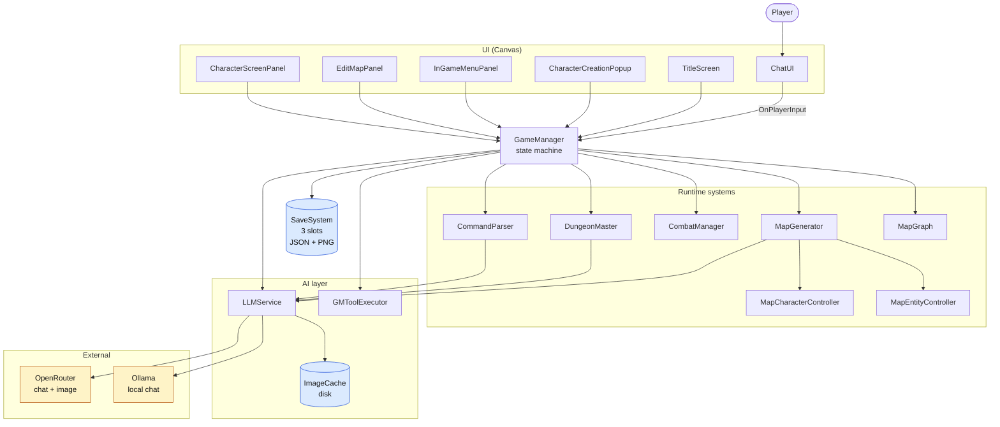

# D&D LLM — AI-Powered Dungeons & Dragons

A 2D top-down D&D 5e game in Unity where the Dungeon Master, the map art, and the NPCs are all generated on demand by Large Language Models. The player types free-form actions; the LLM narrates, mutates game state via a tool-call block, and the map is re-drawn tile-by-tile in a consistent art style.

---

## Highlights

- **Free-form play.** Type anything into the chat panel. The DM narrates in 2–4 sentences, suggests 3 follow-up actions, and optionally emits a `[GM_ACTIONS]` tool block that mutates game state (damage, heal, spawn enemy, lock door, enter sub-region, …).
- **Style-anchored map generation.** `MapGenerator` produces a 7×7 grid of `Floor / Wall / Door / Exit / Chest / EnemySpawn / NpcSpawn / House / Inn / Market / Fountain` tiles, then calls a multimodal image model (Gemini) with the first generated floor tile as a reference so every tile matches the same art style.
- **Sub-map exploration.** Stepping onto a `Door` tile, or the DM emitting `ENTER_SUBREGION`, pushes the current map into a `MapGraph` tree and generates a new interior. Exits pop back and restore the exact prior state — revisits never re-call the LLM.
- **Character creation popup** with player-allocated ability scores, appearance description, backstory, and an LLM-generated portrait. Portraits are re-skinned into top-down map tokens that match the tile art.
- **3-slot save/load.** Slots persist character, campaign seed, DM timeline, full chat history, per-tile description/type overrides, and the portrait PNG. Files live under `Application.persistentDataPath/Saves/`.
- **Two LLM backends.** `LLMService` talks to OpenRouter (chat + image) or Ollama (local chat). Image calls always go to OpenRouter; generated images are cached on disk by prompt.
- **Edit-in-place map editor.** `EditMapPanel` lets you paint tile types and rewrite tile descriptions during play; changes are persisted in the slot.
- **DM voice playback.** Each DM message shows a ▶ button that narrates the line via OpenRouter's `openai/gpt-audio`. An "Auto-play" toggle speaks every new DM message. Audio is cached on disk, keyed by text — replays are offline.

See [`SETUP_GUIDE.md`](SETUP_GUIDE.md) for first-run setup and [`LLM_INTEGRATION_GUIDE.md`](LLM_INTEGRATION_GUIDE.md) for provider configuration and the DM prompt contract.

---

## System overview

**Reading the diagram.** `GameManager` is a singleton state machine with states `MainMenu → CharacterCreation → Exploration → Combat → Dialogue`. Every UI panel feeds input back to it. During `Exploration` it composes a prompt (DM system prompt + tile context + player position) and calls `LLMService.SendPrompt`. The response is split by `GMToolExecutor` into narration (shown in `ChatUI`) and a `[GM_ACTIONS]` block that applies mutations to the player, the map, or entities.

---

## Project layout

| Path | Purpose |
|------|---------|
| `Assets/Scripts/Managers/GameManager.cs` | Singleton state machine, campaign lifecycle, save/load orchestration, DM system prompt |
| `Assets/Scripts/Services/LLMService.cs` | HTTP client for OpenRouter / Ollama; chat + image + style-anchored tile generation |
| `Assets/Scripts/Services/SaveSystem.cs` | 3-slot JSON+PNG persistence |
| `Assets/Scripts/Services/ImageCache.cs` | On-disk cache of generated images keyed by prompt |
| `Assets/Scripts/AI/DungeonMaster.cs` | Campaign timeline and creature-stat generation via `ILLMProvider` |
| `Assets/Scripts/AI/CommandParser.cs` | Natural-language → `IGameCommand` parsing |
| `Assets/Scripts/AI/GMToolExecutor.cs` | Parses and executes `[GM_ACTIONS]` blocks embedded in DM responses |
| `Assets/Scripts/AI/ILLMProvider.cs`, `MockLLMProvider.cs` | Text-only LLM abstraction (used by `DungeonMaster` and `CommandParser`) |
| `Assets/Scripts/Map/MapGenerator.cs` | 7×7 grid generation, style anchor, per-tile LLM description calls |
| `Assets/Scripts/Map/MapCharacterController.cs`, `MapEntityController.cs` | Sprite tokens on the grid |
| `Assets/Scripts/World/MapGraph.cs` | Tree of map snapshots for sub-map navigation |
| `Assets/Scripts/UI/*.cs` | `ChatUI`, `TitleScreen`, `CharacterCreationPopup`, `InGameMenuPanel`, `EditMapPanel`, `CharacterScreenPanel`, theming |
| `Assets/Scripts/Combat/CombatManager.cs` | Turn-based combat state machine |
| `Assets/Scripts/Character/*.cs` | Character stats, abilities, classes, player controller |
| `Assets/Scripts/Utils/SpriteBackgroundRemover.cs` | Alpha-keys generated tokens against the tile style |
| `Assets/Editor/UISceneBuilder.cs` | Editor menu **DnD → Rebuild UI Canvas** that reconstructs the entire in-game UI |

---

## Running it

1. Open the project in Unity 2022.3 or newer.
2. Menu **DnD → Rebuild UI Canvas** (see [`SETUP_GUIDE.md`](SETUP_GUIDE.md)).
3. Select the `LLMService` GameObject, paste an OpenRouter key (or switch `Provider` to `Ollama` and point at `http://localhost:11434`). See [`LLM_INTEGRATION_GUIDE.md`](LLM_INTEGRATION_GUIDE.md) for model recommendations.
4. Press Play. On the title screen choose a slot or **New Game**, type a campaign prompt (e.g. "a flooded crypt under a coastal temple"), finish the character popup, and start exploring.

Save files live at `Application.persistentDataPath/Saves/slot_{0,1,2}.json` (plus a `_portrait.png`).

---

## License

MIT.
